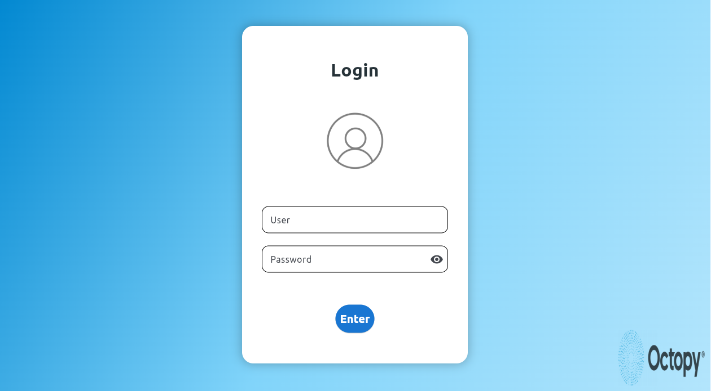

# Tokinomo Control Dashboard with Flet and Flask

This project is a **Dashboard built with Flet** to control a Tokinomo and its features via a **Raspberry Pi 5**.



## Features

- **Login Section:** License authentication to access the Dashboard.  
- **Feature Controls:** buttons to manage illumination, sound, and DC motor.  
- **Automatic Routine:** A button triggers the full routine in an automate way.  
- **Speed Control:** A slider adjusts the spin motor speed via PWM signals.

## Raspberry Pi Communication

The Dashboard communicates remotely with the Raspberry Pi using a **Flask server**:

1. The Dashboard sends **HTTP POST requests** with JSON data that contains button states (on/off or PWM values).  
2. The Flask server decodes the data and executes the programmed logic to:y i
   - Turn GPIOs on or off.  
   - Adjust PWM signals according to user input.

This setup enables full remote control of the Tokinomo through the Dashboard.

## Table of contents
- Requirements
- Installation
- Operation
- Specs
- Project Structure
- Troubleshooting
- Contributing

## Requirements
**Hardware**
- Functional Laptop or PC
- Raspberry pi 5
- DC Motor
- PIR Movement Sensor
- Any sound output
- Any ilumination output
- Actuator to simulate Tokinomo arm.

**Software**
- Ubuntu **v22.04**
- Flet **v0.28.3**
- Flask **v3.1.2**
- Python **v3**

## Installation
This project is structured using a modular approach to ensure clarity and maintainability. The main script, **app.py**, contains only the programming related to the **graphical interface** developed with Flet. It imports two functions from service.py, which manages all communication processes, including the destination IP address configuration, button states for turning the Tokinomo gadget on or off, and the slider control that adjusts the PWM output for a DC motor. This script also handles HTTP POST requests sent to the Raspberry Pi through JSON and processes JSON responses from the server to display either confirmation messages or error states.

Additionally, the Tokinomo.txt script must be copied into a desired folder on the Raspberry Pi 5 **as a .py script**. This script launches the Flask server, receives the HTTP POST requests from the dashboard, and executes the logic that controls the Raspberry Pi GPIO components. Each component, such as sound outputs, LED lighting, or the DC motor, can be individually tested, with the motor speed adjustable through the PWM-controlled slider. The server also runs a background thread that automates the entire routine when the routine button is pressed. Once activated, the routine starts automatically whenever the PIR motion sensor detects movement and continues to operate as long as the routine button remains active.

So, clone this repository to start:

```bash
git clone https://github.com/aTrujillo04/Remote-Dashboard-for-Tokinomo-in-Flet
```
**Now, let's work first in the remote laptop/PC.**
First, let's create a virtual enviroment. This virtual enviroment should be created **inside this repository**, it will contain Flet. 

```bash
cd /route/to/this/repository
python3 -m venv virtual_enviroment_name
source virtual_enviroment_name/bin/activate
```
The previous lines place you in the repository location inside your computer, create your virtual enviroment and activate it. When the virtual enviroment is activated you should see something like this:
**(.virtual_enviroment_name) user@computer:~/route/to/repository$**

Now let's download Flet **inside the new virtual enviroment** and verify the installation by seeing the downloaded version:

```bash
pip install flet
pip show flet
```
You should be able to see something like this: **Flet vX.X.X**
Then, you wil be able to visualize the graphic interface by entering the following command in the terminal:

```bash
python3 app.py
```
First, you will see a login section, which you can bypass by entering the following credentials: **user: adm** and **password: 1**. After logging in, the Tokinomo dashboard will be displayed; however, none of the buttons will function yet because the Flask server on the Raspberry Pi is not running.

To set it up, **on the Raspberry Pi**, create a new folder and copy the contents of [Tokinomo.txt](./Tokinomo.txt).

```bash
cd /route/to/this/repository
python3 -m venv virtual_enviroment_name
source virtual_enviroment_name/bin/activate
```
Then, when the virtual enviroment is activated, you must download Flask and verify the installation like this:

```bash
pip install flask
python3 -m flask --version
```
You should be able to se something like this: **Flask vX.X.X** 

Now, to run the Flask server you should enter in terminal:

```bash
python3 Tokinomo.py
```
If the server **runs optimally** and is waiting for HTTP requests you shold see something like this:

```bash
* Serving Flask app 'Tokinomo'
 * Debug mode: off
WARNING: This is a development server. Do not use it in a production deployment.
 * Running on all addresses (0.0.0.0)
 * Running on http://127.0.0.1:5000
 * Running on http://<tu_IP_local>:5000
Press CTRL+C to quit
```
Finally, let's create a pm2 process and make it a **startup** one so the Flask server will automatically run 15 seconds after the Raspberry is energyzed.

Firt let's create a .sh file **in home**. The file will contain this:

```bash
#!/bin/bash
sleep 15
pm2 start /home/ubuntu_user/folder/Tokinomo.py --name desired_name --interpreter python3
```
Now, let's create the process. First let's install and verify the nodejs and npm installation:

```bash
sudo apt update
sudo apt upgrade -y

sudo apt install -y nodejs
npm -v

sudo npm install -g pm2
pm2 -v
```
After you see the versions, you can confirm the installation. So now, let's create the pm2 process, first making executable the sript.sh you just created:

```bash
chmod +x /home/ubuntu_user/folder/tokinomo_server.sh
```
Now, let's test the pm2 process manually and verity its creation:

```bash
pm2 start /home/pi/Tokinomo/tokinomo_server.sh --desired_name_for_pm2
pm2 status
```
You should see something like this:
```bash
┌─────┬───────────────┬──────┬─────┬─────────┐
│ id  │ name          │ mode │ pid │ status  │
├─────┼───────────────┼──────┼─────┼─────────┤
│ 0   │ tokinomo      │ fork │ 1234│ online  │
└─────┴───────────────┴──────┴─────┴─────────┘
```

FInally, let's make it a **startup** process and save it:

```bash
pm2 startup
```
You will recieve an output such as this one:

```bash
sudo env PATH=$PATH:/usr/bin pm2 startup systemd -u pi --hp /home/user
```
You must copy and enter it to the terminal, and finally make:

```bash
pm2 save
```
To finisth, you must restart the raspberry and verify the pm2 creation:

```bash
sudo reboot
pm2 status
```
Again, you must see something like this, and finish the process:

```bash
┌─────┬───────────────┬──────┬─────┬─────────┐
│ id  │ name          │ mode │ pid │ status  │
├─────┼───────────────┼──────┼─────┼─────────┤
│ 0   │ tokinomo      │ fork │ 1234│ online  │
└─────┴───────────────┴──────┴─────┴─────────┘
```


## Operation
Now the dashboard and Flask server are ready to communicate and start working. But first, we should consider some important points:
- The remote laptop/PC and the Raspberry should be connected to **the same internet network**.
- The IP addres **should be changed** in *service.py* line 3:
  ```bash
  RASP_IP = "http://XXX.XXX.X.XXX:5000"
  ```
The IP addres can be knowed by entering in **Raspberry terminal**:

```bash
hostname -I
```
Now that you considerer the previous points, the dashboard and Flask server should be abile to connect to each other.

## Specs 
For desired changes isnide the dashboard:
- The page title can be modified in the following line (line 6):
  
```bash
 page.title = "Octynomo Dashboard"
```

- The password and user can be defined in the following lines, and also the message showed for incorrect users (line 40-48):

```bash
txt_user = ft.TextField(
        hint_text="User", border_radius=12, bgcolor="white",
        height=55, content_padding=15, text_align=ft.TextAlign.LEFT
    )
    txt_password = ft.TextField(
        hint_text="Password", password=True, can_reveal_password=True,
        border_radius=12, bgcolor="white", height=55, content_padding=15, text_align=ft.TextAlign.LEFT
    )
    txt_error = ft.Text("⚠️ Incorrect user or password", color="red500", visible=False)
```
- The images can be changed in line 71, 112 and 209:

  ```bash
   src="https://desired/image.png",
  ``
- To change dashboard tittles and its properties check from line 184 to 188:

  ```bash
  ft.Text("Octynomo controls", size=34, weight="bold", color="white"),
                ft.Text("Features", size=22, color="white70"),
  ```

  ## Project STructure
  
  Remote-Dashboard-for-Tokinomo-in-Flet/
  |--Raspberry
  | |--Tokinomo.py
  | |---venv
  |  |-Flask
  |
  |--Remote laptop
  | |--app.py
  | |--service.py
  | |-.venv
  |  |-Flet
  |
  |--README.md
  |--fletdash-png
  |.gitignore 

## Troubleshooting

## Contributing
